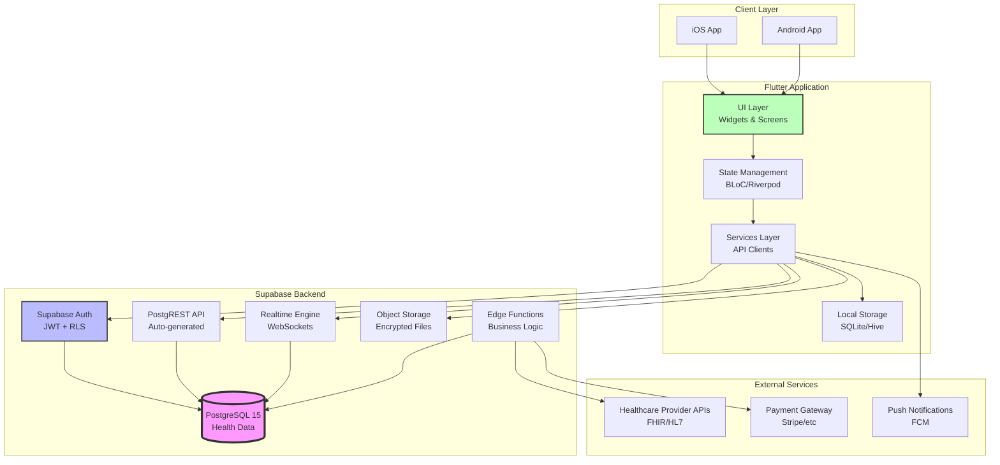
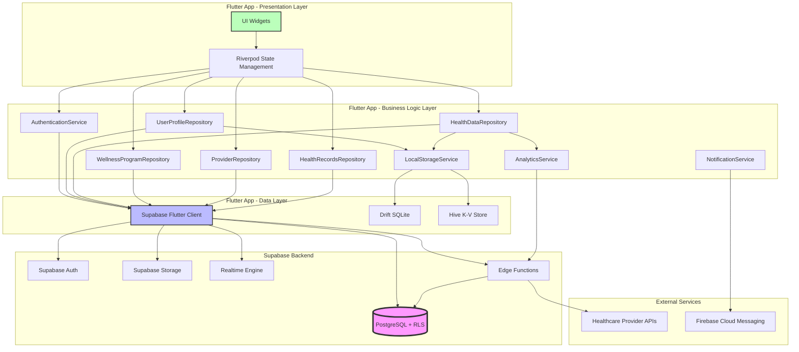
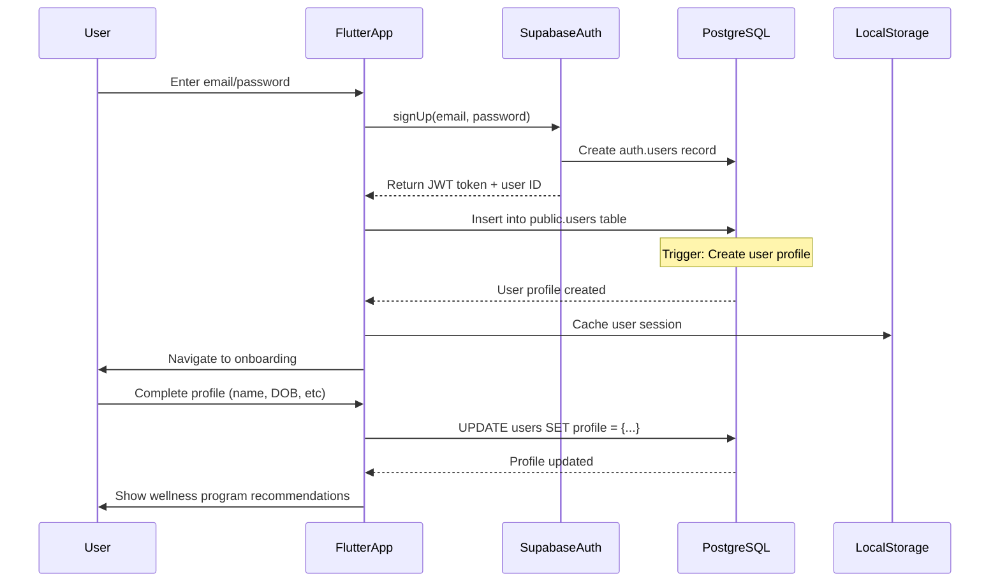
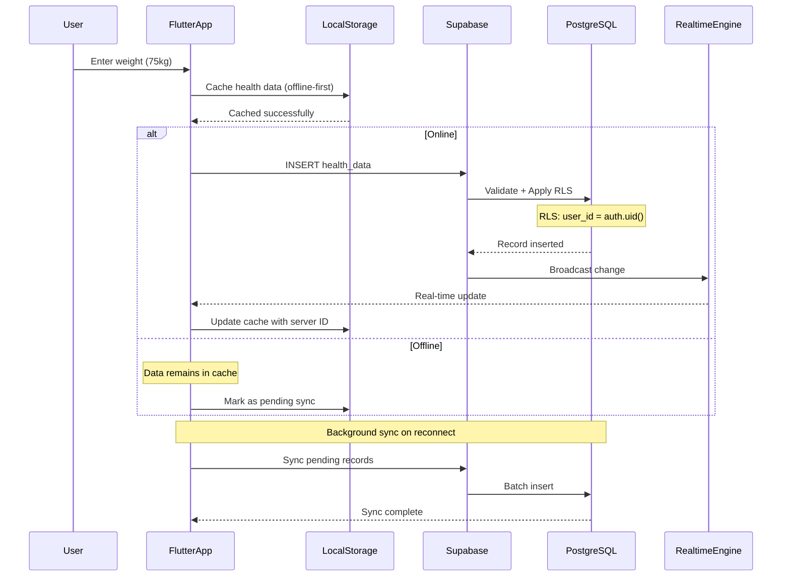
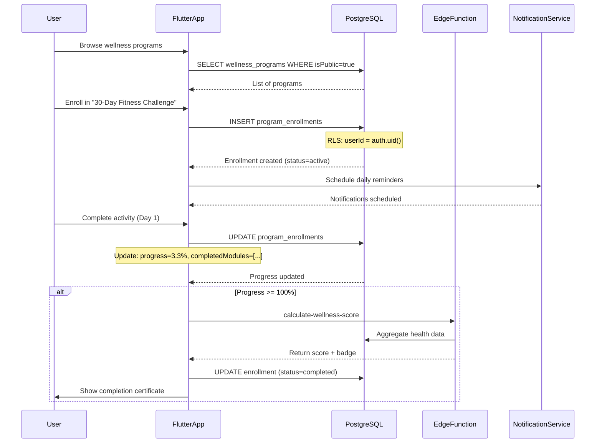
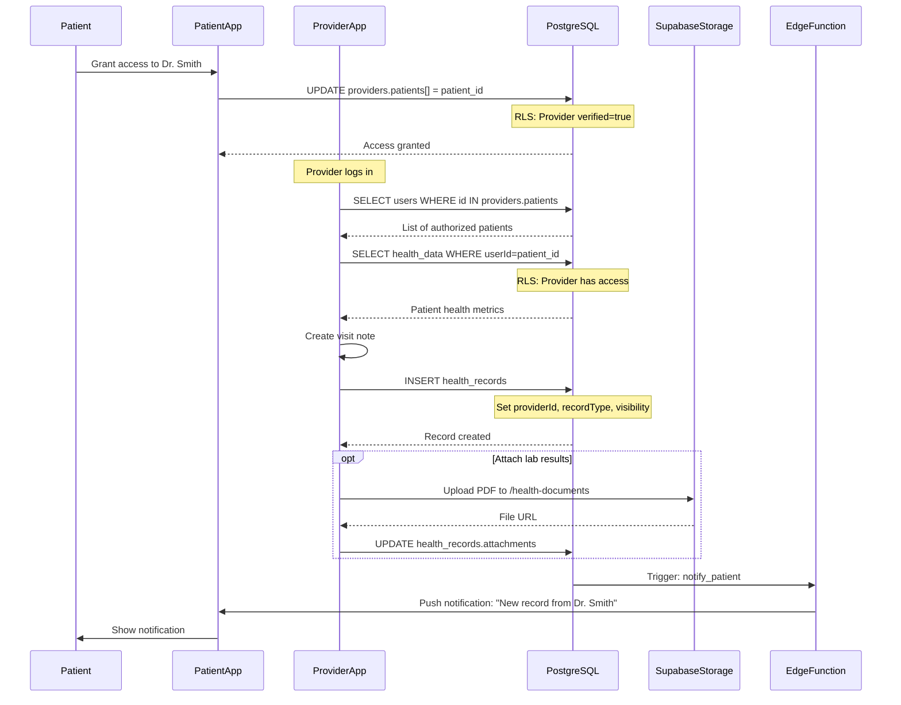
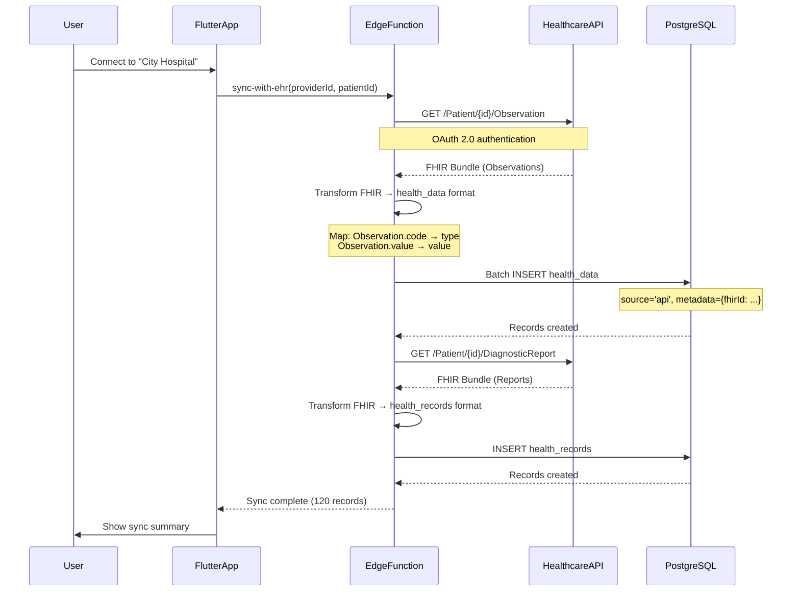
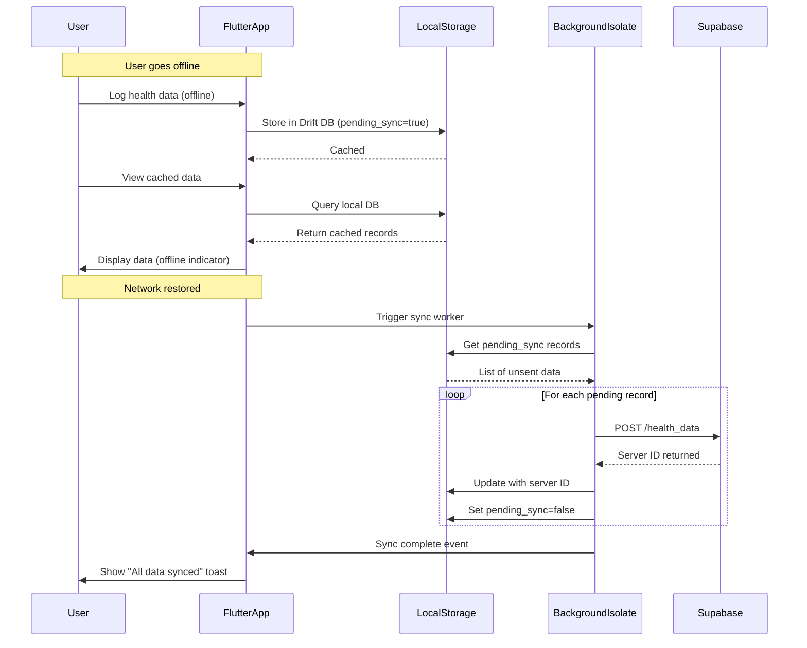
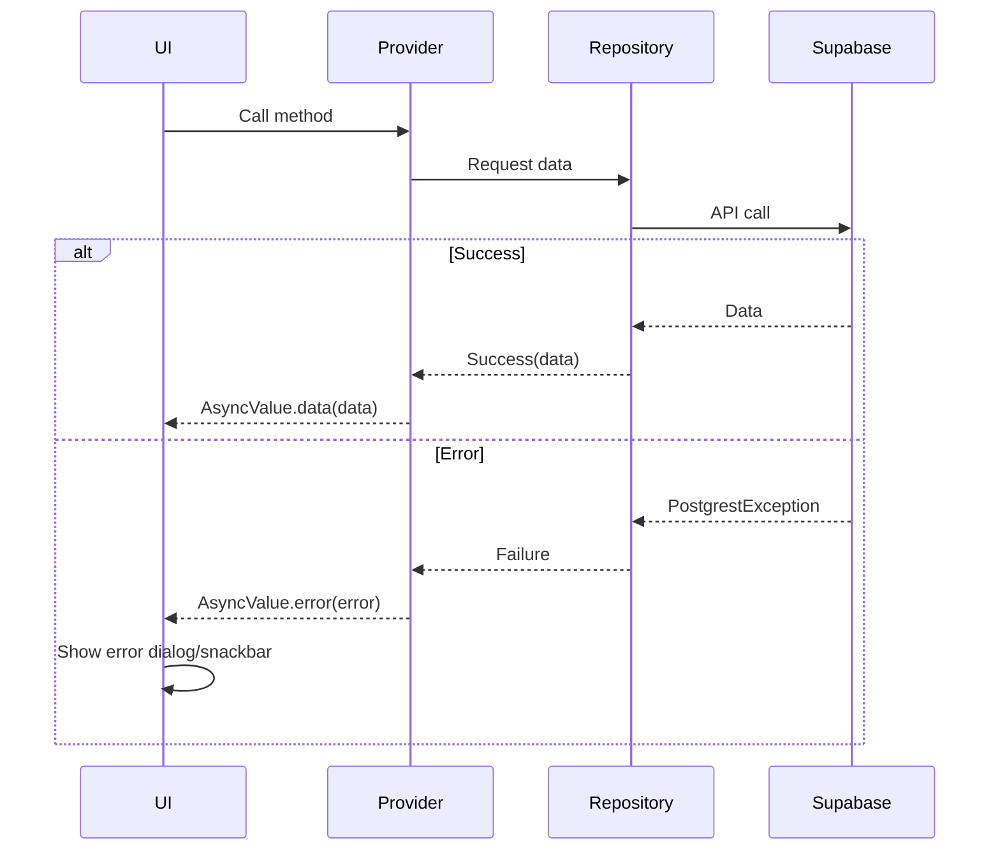

# Kairo Fullstack Architecture Document

## Introduction

This document outlines the complete fullstack architecture for Kairo, including backend systems, frontend implementation, and their integration. It serves as the single source of truth for AI-driven development, ensuring consistency across the entire technology stack.

This unified approach combines what would traditionally be separate backend and frontend architecture documents, streamlining the development process for modern fullstack applications where these concerns are increasingly intertwined.

### Starter Template or Existing Project

**N/A - Greenfield Flutter + Supabase project**

No specific starter template is being used. The project will be built from scratch using:
- Flutter framework (latest stable)
- Supabase Flutter SDK
- Standard Flutter project structure with custom packages for shared code

This approach provides maximum flexibility for implementing the specific health data requirements and compliance needs outlined in the PRD.

### Change Log

| Date | Version | Description | Author |
|------|---------|-------------|--------|
| 2026-01-11 | 1.0 | Initial architecture document | Winston (Architect) |

## High Level Architecture

### Technical Summary

Kairo is a **mobile-first health and wellness platform** built using **Flutter** for cross-platform mobile apps (iOS/Android) with **Supabase** as the Backend-as-a-Service (BaaS). The architecture follows a **client-server pattern** where the Flutter app communicates with Supabase via REST APIs and real-time subscriptions. **PostgreSQL** serves as the primary database with **Row Level Security (RLS)** policies enforcing data isolation and access control. The system integrates with external **healthcare provider APIs** for medical record synchronization and uses **AES-256 encryption** for sensitive health data at rest. This architecture achieves PRD goals by providing secure, HIPAA-compliant health data management, real-time wellness program tracking, and seamless healthcare provider integration while maintaining excellent mobile performance and offline-first capabilities.

### Platform and Infrastructure Choice

**Platform:** Supabase (hosted PostgreSQL + Auth + Storage + Real-time)
**Key Services:**
- Supabase Database (PostgreSQL 15+)
- Supabase Auth (JWT-based authentication)
- Supabase Storage (encrypted file storage for health documents)
- Supabase Realtime (WebSocket subscriptions)
- Edge Functions (Deno runtime for serverless logic)

**Deployment Host and Regions:**
- Supabase Cloud (AWS infrastructure)
- Primary region: US-East-1 (or user-selectable based on compliance needs)
- CDN: Automatic via Supabase edge network

### Repository Structure

**Structure:** Monorepo (single repository containing Flutter app and supporting code)
**Monorepo Tool:** Not required - Flutter project with packages
**Package Organization:**
- `kairo/` - Main Flutter application
- `kairo/packages/` - Shared packages (data models, API clients, utilities)
- Supabase backend configuration in `supabase/` directory

### High Level Architecture Diagram



### Architectural Patterns

- **Backend-as-a-Service (BaaS):** Leverage Supabase for managed infrastructure, reducing operational complexity - _Rationale:_ Allows team to focus on app features rather than backend infrastructure management, critical for fast iteration_

- **Layered Architecture (Flutter):** Separate presentation, business logic, and data layers - _Rationale:_ Enables testability, maintainability, and clear separation of concerns in mobile app_

- **BLoC/Riverpod Pattern:** State management using streams and reactive programming - _Rationale:_ Official Flutter recommendation, excellent for complex state like health data tracking_

- **Repository Pattern:** Abstract data sources (Supabase API, local cache) behind repositories - _Rationale:_ Enables offline-first functionality and easy testing with mock data sources_

- **Row Level Security (RLS):** Database-level access control for multi-tenant data isolation - _Rationale:_ Critical for healthcare data privacy, ensures users only access their own health records_

- **Offline-First:** Local data persistence with background sync - _Rationale:_ Health apps must work without internet connectivity, sync when available_

- **API Gateway Pattern:** Supabase PostgREST as unified API layer - _Rationale:_ Auto-generated REST API from database schema, eliminates boilerplate backend code_

## Tech Stack

This is the **DEFINITIVE** technology selection for the entire project. All development must use these exact versions.

| Category | Technology | Version | Purpose | Rationale |
|----------|-----------|---------|---------|-----------|
| Frontend Language | Dart | 3.2+ | Flutter programming language | Type-safe, null-safe, optimized for Flutter framework |
| Frontend Framework | Flutter | 3.16+ | Cross-platform mobile UI framework | Single codebase for iOS/Android, excellent performance, material/cupertino design |
| UI Component Library | Flutter Material 3 | Built-in | Design system and widgets | Native Flutter components, follows Material Design 3 guidelines |
| State Management | Riverpod | 2.4+ | Reactive state management | Type-safe, testable, recommended by Flutter community over Provider |
| Backend Language | TypeScript/Deno | Latest | Edge Functions serverless runtime | Type safety for serverless functions, Supabase native support |
| Backend Framework | Supabase | Latest | Backend-as-a-Service platform | Managed PostgreSQL, auth, storage, real-time in one platform |
| API Style | REST (PostgREST) | Auto-generated | Database-driven REST API | Supabase auto-generates from schema, reduces boilerplate |
| Database | PostgreSQL | 15+ | Primary relational database | ACID compliance, complex queries, RLS for security, healthcare data modeling |
| Cache | Hive | 2.2+ | Local offline storage | Fast key-value store, encrypted, works offline |
| File Storage | Supabase Storage | Latest | Encrypted file/document storage | Integrated with auth, automatic encryption, healthcare documents |
| Authentication | Supabase Auth | Latest | User authentication & authorization | JWT tokens, email/social auth, RLS integration, MFA support |
| Frontend Testing | Flutter Test | Built-in | Unit and widget testing | Native Flutter testing framework |
| Backend Testing | Deno Test | Built-in | Edge Function testing | Native Deno testing capabilities |
| E2E Testing | Patrol | 2.6+ | End-to-end integration tests | Better than integration_test, native gestures, easier setup |
| Build Tool | Flutter CLI | Built-in | Build and package management | Official Flutter tooling |
| Bundler | Dart Build | Built-in | Dart code compilation | Native Dart/Flutter build system |
| IaC Tool | Supabase CLI | Latest | Database migrations and config | Version control for schema, RLS policies, Edge Functions |
| CI/CD | GitHub Actions | Latest | Continuous integration/deployment | Free for public repos, Flutter support, Supabase deployment |
| Monitoring | Sentry | Latest | Error tracking and performance | Flutter SDK, release tracking, user feedback |
| Logging | Supabase Logs | Built-in | Backend logging and analytics | Integrated platform logging |
| CSS Framework | N/A | N/A | Not applicable for Flutter | Flutter uses widget-based styling |
| HTTP Client | Dio | 5.4+ | Network requests | Interceptors, retries, better than http package |
| Local Database | Drift | 2.14+ | SQLite ORM for offline | Type-safe queries, migrations, reactive streams |

## Data Models

### User

**Purpose:** Represents a user account with authentication credentials, profile information, and role-based access control.

**Key Attributes:**
- `id`: UUID - Unique identifier (maps to Supabase Auth UID)
- `email`: string - User's email address
- `role`: enum('user', 'admin', 'provider') - Access control role
- `profile`: UserProfile - Embedded profile data
- `createdAt`: timestamp - Account creation date
- `updatedAt`: timestamp - Last update timestamp

#### TypeScript Interface
```typescript
interface User {
  id: string; // UUID
  email: string;
  role: 'user' | 'admin' | 'provider';
  profile: {
    firstName: string;
    lastName: string;
    dateOfBirth: string; // ISO date
    gender?: 'male' | 'female' | 'other' | 'prefer_not_to_say';
    phoneNumber?: string;
    avatar?: string; // URL to Supabase Storage
  };
  preferences: {
    notificationsEnabled: boolean;
    dataShareConsent: boolean;
    theme: 'light' | 'dark' | 'system';
  };
  createdAt: string; // ISO timestamp
  updatedAt: string; // ISO timestamp
}
```

#### Relationships
- Has many `HealthData` records
- Has many `ProgramEnrollment` records
- Has many `HealthRecord` records
- Providers have many linked `Provider` profiles

### HealthData

**Purpose:** Stores user-generated health metrics and biometric data with encryption support.

**Key Attributes:**
- `id`: UUID - Unique identifier
- `userId`: UUID - Foreign key to User
- `type`: enum - Type of health data (weight, blood_pressure, steps, etc.)
- `value`: JSONB - Encrypted health metric values
- `recordedAt`: timestamp - When measurement was taken
- `source`: string - Data source (manual, device, API)

#### TypeScript Interface
```typescript
interface HealthData {
  id: string;
  userId: string;
  type: 'weight' | 'blood_pressure' | 'heart_rate' | 'steps' | 'sleep' | 'glucose' | 'custom';
  value: {
    // Type-specific structure
    // For weight: { value: number, unit: 'kg' | 'lbs' }
    // For blood_pressure: { systolic: number, diastolic: number, unit: 'mmHg' }
    // For steps: { count: number }
    [key: string]: any;
  };
  recordedAt: string; // ISO timestamp
  source: 'manual' | 'device' | 'api' | 'provider';
  metadata?: {
    deviceId?: string;
    accuracy?: number;
    notes?: string;
  };
  createdAt: string;
  updatedAt: string;
}
```

#### Relationships
- Belongs to `User`
- May be linked to `HealthRecord` (provider-verified data)

### WellnessProgram

**Purpose:** Defines wellness programs, challenges, and health improvement plans that users can join.

**Key Attributes:**
- `id`: UUID - Unique identifier
- `name`: string - Program name
- `description`: string - Detailed program description
- `category`: enum - Program category
- `duration`: number - Duration in days
- `goals`: array - Program objectives
- `content`: JSONB - Program curriculum and activities

#### TypeScript Interface
```typescript
interface WellnessProgram {
  id: string;
  name: string;
  description: string;
  category: 'fitness' | 'nutrition' | 'mental_health' | 'chronic_disease' | 'general_wellness';
  duration: number; // days
  difficulty: 'beginner' | 'intermediate' | 'advanced';
  goals: string[];
  content: {
    modules: Array<{
      id: string;
      title: string;
      description: string;
      order: number;
      activities: Array<{
        type: 'exercise' | 'reading' | 'quiz' | 'tracking';
        title: string;
        duration?: number; // minutes
        content: any;
      }>;
    }>;
  };
  isPublic: boolean;
  createdBy?: string; // admin or provider user ID
  imageUrl?: string;
  createdAt: string;
  updatedAt: string;
}
```

#### Relationships
- Has many `ProgramEnrollment` records
- Created by `User` (admin/provider role)

### ProgramEnrollment

**Purpose:** Tracks user participation in wellness programs with progress and completion data.

**Key Attributes:**
- `id`: UUID - Unique identifier
- `userId`: UUID - Foreign key to User
- `programId`: UUID - Foreign key to WellnessProgram
- `status`: enum - Enrollment status
- `progress`: number - Completion percentage
- `startedAt`: timestamp - Enrollment start date
- `completedAt`: timestamp - Completion date (nullable)

#### TypeScript Interface
```typescript
interface ProgramEnrollment {
  id: string;
  userId: string;
  programId: string;
  status: 'active' | 'completed' | 'paused' | 'dropped';
  progress: number; // 0-100 percentage
  currentModuleId?: string;
  completedModules: string[]; // Array of module IDs
  activityLog: Array<{
    moduleId: string;
    activityId: string;
    completedAt: string;
    result?: any; // quiz scores, etc.
  }>;
  startedAt: string;
  completedAt?: string;
  createdAt: string;
  updatedAt: string;
}
```

#### Relationships
- Belongs to `User`
- Belongs to `WellnessProgram`

### Provider

**Purpose:** Represents healthcare providers who can access patient data and create health records.

**Key Attributes:**
- `id`: UUID - Unique identifier
- `userId`: UUID - Links to User account with 'provider' role
- `organization`: string - Healthcare organization name
- `credentials`: string - Medical credentials/certifications
- `specialization`: string - Medical specialization
- `licenseNumber`: string - Professional license number

#### TypeScript Interface
```typescript
interface Provider {
  id: string;
  userId: string; // Links to User with role='provider'
  organization: string;
  credentials: string; // e.g., "MD", "RN", "NP"
  specialization: string; // e.g., "Cardiology", "Primary Care"
  licenseNumber: string;
  licenseState?: string;
  verified: boolean; // Admin-verified provider
  patients: string[]; // Array of user IDs with granted access
  contactInfo: {
    phone?: string;
    email?: string;
    address?: string;
  };
  createdAt: string;
  updatedAt: string;
}
```

#### Relationships
- Belongs to `User` (one-to-one)
- Has access to multiple `User` health data (many-to-many)
- Creates `HealthRecord` entries

### HealthRecord

**Purpose:** Stores provider-entered medical records and clinical documentation linked to users.

**Key Attributes:**
- `id`: UUID - Unique identifier
- `userId`: UUID - Patient user ID
- `providerId`: UUID - Provider who created record
- `recordType`: enum - Type of medical record
- `content`: JSONB - Encrypted medical record data
- `recordDate`: timestamp - Date of medical event/visit

#### TypeScript Interface
```typescript
interface HealthRecord {
  id: string;
  userId: string; // Patient
  providerId: string; // Healthcare provider
  recordType: 'visit_note' | 'lab_result' | 'prescription' | 'diagnosis' | 'imaging' | 'other';
  title: string;
  content: {
    // Type-specific structure
    // For visit_note: { chiefComplaint, assessment, plan, vitals }
    // For lab_result: { testName, results, referenceRange, interpretation }
    [key: string]: any;
  };
  recordDate: string; // Date of the medical event
  attachments?: Array<{
    id: string;
    fileName: string;
    fileUrl: string; // Supabase Storage URL
    fileType: string;
  }>;
  visibility: 'private' | 'shared_with_user'; // Provider can keep notes private
  createdAt: string;
  updatedAt: string;
}
```

#### Relationships
- Belongs to `User` (patient)
- Belongs to `Provider`
- May reference `HealthData` entries

## API Specification

For Kairo's Flutter mobile app, we use the **Supabase Flutter SDK** which provides Dart-native client libraries. The "API" is the Supabase client interface, not traditional REST endpoints.

### Supabase Client Interface

**Primary Integration Method:**
- **Supabase Flutter SDK** (`supabase_flutter` package)
- Direct database access via Dart client (PostgREST under the hood)
- Type-safe queries using Dart syntax
- Automatic JWT authentication
- Real-time subscriptions via WebSockets

### Core Client Operations

#### Authentication

```dart
import 'package:supabase_flutter/supabase_flutter.dart';

final supabase = Supabase.instance.client;

// Sign up
final AuthResponse authResponse = await supabase.auth.signUp(
  email: 'user@example.com',
  password: 'password123',
  data: {'role': 'user'},
);

// Sign in
await supabase.auth.signInWithPassword(
  email: 'user@example.com',
  password: 'password123',
);

// Sign out
await supabase.auth.signOut();

// Get current session
final Session? session = supabase.auth.currentSession;
final User? user = supabase.auth.currentUser;
```

#### User Profile Operations

```dart
// Get current user profile
final userProfile = await supabase
  .from('users')
  .select()
  .eq('id', supabase.auth.currentUser!.id)
  .single();

// Update user profile
await supabase
  .from('users')
  .update({
    'profile': {
      'firstName': 'John',
      'lastName': 'Doe',
    },
    'preferences': {
      'notificationsEnabled': true,
      'theme': 'dark',
    },
  })
  .eq('id', supabase.auth.currentUser!.id);
```

#### Health Data Operations

```dart
// Create health data entry
final healthData = await supabase
  .from('health_data')
  .insert({
    'userId': supabase.auth.currentUser!.id,
    'type': 'weight',
    'value': {'value': 75.5, 'unit': 'kg'},
    'recordedAt': DateTime.now().toIso8601String(),
    'source': 'manual',
  })
  .select()
  .single();

// Get recent health data by type
final weightData = await supabase
  .from('health_data')
  .select()
  .eq('type', 'weight')
  .order('recordedAt', ascending: false)
  .limit(30);

// Get health data in date range
final data = await supabase
  .from('health_data')
  .select()
  .gte('recordedAt', startDate.toIso8601String())
  .lte('recordedAt', endDate.toIso8601String())
  .order('recordedAt');

// Real-time subscription to health data changes
final subscription = supabase
  .from('health_data')
  .stream(primaryKey: ['id'])
  .eq('userId', supabase.auth.currentUser!.id)
  .listen((data) {
    // Handle real-time updates
    print('Health data updated: $data');
  });
```

#### Wellness Program Operations

```dart
// Get all public wellness programs
final programs = await supabase
  .from('wellness_programs')
  .select()
  .eq('isPublic', true)
  .order('createdAt', ascending: false);

// Get programs by category
final fitnessPrograms = await supabase
  .from('wellness_programs')
  .select()
  .eq('category', 'fitness')
  .eq('difficulty', 'beginner');

// Enroll in program
final enrollment = await supabase
  .from('program_enrollments')
  .insert({
    'userId': supabase.auth.currentUser!.id,
    'programId': programId,
    'status': 'active',
    'progress': 0,
    'startedAt': DateTime.now().toIso8601String(),
  })
  .select()
  .single();

// Update enrollment progress
await supabase
  .from('program_enrollments')
  .update({
    'progress': 45,
    'currentModuleId': 'module-2',
    'completedModules': ['module-1'],
  })
  .eq('id', enrollmentId);

// Get user enrollments with program details
final myEnrollments = await supabase
  .from('program_enrollments')
  .select('*, wellness_programs(*)')
  .eq('userId', supabase.auth.currentUser!.id)
  .eq('status', 'active');
```

#### Provider & Health Records

```dart
// Search providers by specialization
final providers = await supabase
  .from('providers')
  .select('*, users!inner(profile)')
  .eq('verified', true)
  .ilike('specialization', '%cardiology%');

// Get patient health records
final records = await supabase
  .from('health_records')
  .select('*, providers(*)')
  .eq('userId', supabase.auth.currentUser!.id)
  .eq('visibility', 'shared_with_user')
  .order('recordDate', ascending: false);

// Provider creates health record (provider role only)
await supabase
  .from('health_records')
  .insert({
    'userId': patientId,
    'providerId': supabase.auth.currentUser!.id,
    'recordType': 'visit_note',
    'title': 'Annual Checkup',
    'content': {
      'chiefComplaint': 'Routine checkup',
      'vitals': {'bp': '120/80', 'heartRate': 72},
      'assessment': 'Healthy',
      'plan': 'Continue current wellness program',
    },
    'recordDate': DateTime.now().toIso8601String(),
    'visibility': 'shared_with_user',
  });
```

#### File Storage Operations

```dart
// Upload health document/image
final file = File('path/to/document.pdf');
final fileName = '${DateTime.now().millisecondsSinceEpoch}_document.pdf';

await supabase.storage
  .from('health-documents')
  .upload(
    '${supabase.auth.currentUser!.id}/$fileName',
    file,
    fileOptions: const FileOptions(
      cacheControl: '3600',
      upsert: false,
    ),
  );

// Get public URL
final publicUrl = supabase.storage
  .from('health-documents')
  .getPublicUrl('${supabase.auth.currentUser!.id}/$fileName');

// Download file
final fileData = await supabase.storage
  .from('health-documents')
  .download('${supabase.auth.currentUser!.id}/$fileName');
```

#### Edge Functions (Custom Business Logic)

```dart
// Call Edge Function for bulk health data sync
final response = await supabase.functions.invoke(
  'sync-health-data',
  body: {
    'entries': [
      {'type': 'steps', 'value': {'count': 8500}, 'recordedAt': '2024-01-10T12:00:00Z'},
      {'type': 'heart_rate', 'value': {'bpm': 72}, 'recordedAt': '2024-01-10T12:00:00Z'},
    ],
  },
);

// Calculate wellness score
final scoreResponse = await supabase.functions.invoke(
  'calculate-wellness-score',
  body: {'userId': supabase.auth.currentUser!.id},
);

final score = scoreResponse.data['score'];
final recommendations = scoreResponse.data['recommendations'];
```

### Real-time Subscriptions

```dart
// Subscribe to wellness program updates
final programStream = supabase
  .from('wellness_programs')
  .stream(primaryKey: ['id'])
  .eq('isPublic', true);

programStream.listen((programs) {
  // Update UI when programs change
});

// Subscribe to enrollment status changes
final enrollmentStream = supabase
  .from('program_enrollments')
  .stream(primaryKey: ['id'])
  .eq('userId', supabase.auth.currentUser!.id);

enrollmentStream.listen((enrollments) {
  // Update UI when enrollment progresses
});
```

### Error Handling

```dart
try {
  final data = await supabase
    .from('health_data')
    .insert(healthDataEntry);
} on PostgrestException catch (error) {
  // Handle database errors
  print('Database error: ${error.message}');
} on StorageException catch (error) {
  // Handle storage errors
  print('Storage error: ${error.message}');
} catch (error) {
  // Handle general errors
  print('Unknown error: $error');
}
```

## Components

### AuthenticationService

**Responsibility:** Manages user authentication, session management, and token refresh

**Key Interfaces:**
- `signUp(email, password, userData)` → AuthResponse
- `signIn(email, password)` → AuthResponse
- `signOut()` → void
- `getCurrentUser()` → User?
- `onAuthStateChange()` → Stream<AuthState>

**Dependencies:** Supabase Auth client

**Technology Stack:** Dart, Supabase Flutter SDK, Riverpod for state management

### UserProfileRepository

**Responsibility:** CRUD operations for user profiles and preferences

**Key Interfaces:**
- `getUserProfile(userId)` → User
- `updateProfile(userId, profileData)` → User
- `updatePreferences(userId, preferences)` → User
- `uploadAvatar(userId, imageFile)` → String (URL)

**Dependencies:** Supabase Database client, Supabase Storage client

**Technology Stack:** Dart, Repository pattern, Drift for local caching

### HealthDataRepository

**Responsibility:** Manages health metrics storage, retrieval, and real-time sync

**Key Interfaces:**
- `addHealthData(type, value, recordedAt)` → HealthData
- `getHealthDataByType(type, dateRange)` → List<HealthData>
- `getHealthDataStream(type)` → Stream<List<HealthData>>
- `bulkSyncHealthData(entries)` → SyncResult
- `deleteHealthData(id)` → void

**Dependencies:** Supabase Database, Drift for offline storage, Edge Functions for bulk sync

**Technology Stack:** Dart, Supabase client, Drift SQLite, Real-time subscriptions

### WellnessProgramRepository

**Responsibility:** Manages wellness programs and user enrollments

**Key Interfaces:**
- `getPublicPrograms(category?, difficulty?)` → List<WellnessProgram>
- `getProgramById(id)` → WellnessProgram
- `enrollInProgram(programId)` → ProgramEnrollment
- `updateEnrollmentProgress(enrollmentId, progress)` → ProgramEnrollment
- `getUserEnrollments(status?)` → List<ProgramEnrollment>

**Dependencies:** Supabase Database client

**Technology Stack:** Dart, Supabase client, Riverpod state management

### ProviderRepository

**Responsibility:** Healthcare provider management and patient access control

**Key Interfaces:**
- `searchProviders(specialization?, verified?)` → List<Provider>
- `getProviderById(id)` → Provider
- `grantProviderAccess(providerId)` → void
- `revokeProviderAccess(providerId)` → void
- `getAuthorizedProviders()` → List<Provider>

**Dependencies:** Supabase Database client, RLS policies

**Technology Stack:** Dart, Supabase client

### HealthRecordsRepository

**Responsibility:** Medical records access and management (patient and provider views)

**Key Interfaces:**
- `getPatientRecords(userId, recordType?)` → List<HealthRecord>
- `createHealthRecord(patientId, recordData)` → HealthRecord (provider only)
- `getRecordById(id)` → HealthRecord
- `uploadRecordAttachment(recordId, file)` → Attachment

**Dependencies:** Supabase Database, Supabase Storage

**Technology Stack:** Dart, Supabase client, role-based access control

### LocalStorageService

**Responsibility:** Offline data persistence and sync management

**Key Interfaces:**
- `cacheHealthData(data)` → void
- `getCachedHealthData(type, dateRange)` → List<HealthData>
- `syncPendingChanges()` → SyncResult
- `clearCache()` → void
- `getSyncStatus()` → SyncStatus

**Dependencies:** Drift SQLite, Hive for key-value storage

**Technology Stack:** Drift ORM, Hive, background isolates for sync

### NotificationService

**Responsibility:** Push notifications and in-app alerts

**Key Interfaces:**
- `requestPermissions()` → bool
- `registerDevice(fcmToken)` → void
- `onNotificationReceived()` → Stream<Notification>
- `scheduleLocalNotification(title, body, time)` → void

**Dependencies:** Firebase Cloud Messaging, Supabase Edge Functions

**Technology Stack:** FCM plugin, local notifications

### AnalyticsService

**Responsibility:** Usage tracking, wellness score calculation, and insights generation

**Key Interfaces:**
- `calculateWellnessScore(userId)` → WellnessScore
- `getHealthInsights(userId, timeframe)` → List<Insight>
- `trackEvent(eventName, properties)` → void
- `generateHealthReport(userId, dateRange)` → Report

**Dependencies:** Supabase Edge Functions, health data repository

**Technology Stack:** Deno Edge Functions, TypeScript, Sentry analytics

### ExternalHealthAPIIntegration

**Responsibility:** Integration with external healthcare provider APIs (FHIR/HL7)

**Key Interfaces:**
- `fetchPatientRecords(providerId, patientId)` → List<HealthRecord>
- `syncWithEHR(providerId)` → SyncResult
- `validateFHIRResource(resource)` → bool

**Dependencies:** Healthcare provider APIs, Supabase Edge Functions

**Technology Stack:** Deno Edge Functions, FHIR client libraries

### Component Diagrams



## Core Workflows

### User Registration & Onboarding



### Health Data Entry & Sync



### Wellness Program Enrollment & Progress Tracking



### Healthcare Provider Access & Record Creation



### External Health API Integration (FHIR Sync)



### Offline Mode with Background Sync



## Database Schema

### Complete PostgreSQL Schema

```sql
-- Enable required extensions
CREATE EXTENSION IF NOT EXISTS "uuid-ossp";
CREATE EXTENSION IF NOT EXISTS "pgcrypto";

-- ============================================================================
-- USERS TABLE
-- ============================================================================
CREATE TABLE public.users (
    id UUID PRIMARY KEY REFERENCES auth.users(id) ON DELETE CASCADE,
    email TEXT NOT NULL UNIQUE,
    role TEXT NOT NULL CHECK (role IN ('user', 'admin', 'provider')) DEFAULT 'user',
    profile JSONB NOT NULL DEFAULT '{}',
    preferences JSONB NOT NULL DEFAULT '{"notificationsEnabled": true, "dataShareConsent": false, "theme": "system"}',
    created_at TIMESTAMPTZ NOT NULL DEFAULT NOW(),
    updated_at TIMESTAMPTZ NOT NULL DEFAULT NOW()
);

-- Indexes for users table
CREATE INDEX idx_users_email ON public.users(email);
CREATE INDEX idx_users_role ON public.users(role);
CREATE INDEX idx_users_profile_gin ON public.users USING GIN(profile);

-- Trigger to auto-update updated_at
CREATE OR REPLACE FUNCTION update_updated_at_column()
RETURNS TRIGGER AS $$
BEGIN
    NEW.updated_at = NOW();
    RETURN NEW;
END;
$$ LANGUAGE plpgsql;

CREATE TRIGGER update_users_updated_at BEFORE UPDATE ON public.users
    FOR EACH ROW EXECUTE FUNCTION update_updated_at_column();

-- ============================================================================
-- HEALTH_DATA TABLE
-- ============================================================================
CREATE TABLE public.health_data (
    id UUID PRIMARY KEY DEFAULT uuid_generate_v4(),
    user_id UUID NOT NULL REFERENCES public.users(id) ON DELETE CASCADE,
    type TEXT NOT NULL CHECK (type IN ('weight', 'blood_pressure', 'heart_rate', 'steps', 'sleep', 'glucose', 'custom')),
    value JSONB NOT NULL,
    recorded_at TIMESTAMPTZ NOT NULL,
    source TEXT NOT NULL CHECK (source IN ('manual', 'device', 'api', 'provider')) DEFAULT 'manual',
    metadata JSONB DEFAULT '{}',
    created_at TIMESTAMPTZ NOT NULL DEFAULT NOW(),
    updated_at TIMESTAMPTZ NOT NULL DEFAULT NOW()
);

-- Indexes for health_data table
CREATE INDEX idx_health_data_user_id ON public.health_data(user_id);
CREATE INDEX idx_health_data_type ON public.health_data(type);
CREATE INDEX idx_health_data_recorded_at ON public.health_data(recorded_at DESC);
CREATE INDEX idx_health_data_user_type ON public.health_data(user_id, type);
CREATE INDEX idx_health_data_user_recorded ON public.health_data(user_id, recorded_at DESC);
CREATE INDEX idx_health_data_value_gin ON public.health_data USING GIN(value);

CREATE TRIGGER update_health_data_updated_at BEFORE UPDATE ON public.health_data
    FOR EACH ROW EXECUTE FUNCTION update_updated_at_column();

-- ============================================================================
-- WELLNESS_PROGRAMS TABLE
-- ============================================================================
CREATE TABLE public.wellness_programs (
    id UUID PRIMARY KEY DEFAULT uuid_generate_v4(),
    name TEXT NOT NULL,
    description TEXT NOT NULL,
    category TEXT NOT NULL CHECK (category IN ('fitness', 'nutrition', 'mental_health', 'chronic_disease', 'general_wellness')),
    duration INTEGER NOT NULL CHECK (duration > 0),
    difficulty TEXT NOT NULL CHECK (difficulty IN ('beginner', 'intermediate', 'advanced')),
    goals TEXT[] NOT NULL DEFAULT '{}',
    content JSONB NOT NULL DEFAULT '{}',
    is_public BOOLEAN NOT NULL DEFAULT true,
    created_by UUID REFERENCES public.users(id) ON DELETE SET NULL,
    image_url TEXT,
    created_at TIMESTAMPTZ NOT NULL DEFAULT NOW(),
    updated_at TIMESTAMPTZ NOT NULL DEFAULT NOW()
);

-- Indexes for wellness_programs table
CREATE INDEX idx_wellness_programs_category ON public.wellness_programs(category);
CREATE INDEX idx_wellness_programs_difficulty ON public.wellness_programs(difficulty);
CREATE INDEX idx_wellness_programs_is_public ON public.wellness_programs(is_public);
CREATE INDEX idx_wellness_programs_created_by ON public.wellness_programs(created_by);
CREATE INDEX idx_wellness_programs_content_gin ON public.wellness_programs USING GIN(content);

CREATE TRIGGER update_wellness_programs_updated_at BEFORE UPDATE ON public.wellness_programs
    FOR EACH ROW EXECUTE FUNCTION update_updated_at_column();

-- ============================================================================
-- PROGRAM_ENROLLMENTS TABLE
-- ============================================================================
CREATE TABLE public.program_enrollments (
    id UUID PRIMARY KEY DEFAULT uuid_generate_v4(),
    user_id UUID NOT NULL REFERENCES public.users(id) ON DELETE CASCADE,
    program_id UUID NOT NULL REFERENCES public.wellness_programs(id) ON DELETE CASCADE,
    status TEXT NOT NULL CHECK (status IN ('active', 'completed', 'paused', 'dropped')) DEFAULT 'active',
    progress NUMERIC(5,2) NOT NULL DEFAULT 0 CHECK (progress >= 0 AND progress <= 100),
    current_module_id TEXT,
    completed_modules TEXT[] NOT NULL DEFAULT '{}',
    activity_log JSONB NOT NULL DEFAULT '[]',
    started_at TIMESTAMPTZ NOT NULL DEFAULT NOW(),
    completed_at TIMESTAMPTZ,
    created_at TIMESTAMPTZ NOT NULL DEFAULT NOW(),
    updated_at TIMESTAMPTZ NOT NULL DEFAULT NOW(),
    UNIQUE(user_id, program_id)
);

-- Indexes for program_enrollments table
CREATE INDEX idx_program_enrollments_user_id ON public.program_enrollments(user_id);
CREATE INDEX idx_program_enrollments_program_id ON public.program_enrollments(program_id);
CREATE INDEX idx_program_enrollments_status ON public.program_enrollments(status);
CREATE INDEX idx_program_enrollments_user_status ON public.program_enrollments(user_id, status);
CREATE INDEX idx_program_enrollments_activity_log_gin ON public.program_enrollments USING GIN(activity_log);

CREATE TRIGGER update_program_enrollments_updated_at BEFORE UPDATE ON public.program_enrollments
    FOR EACH ROW EXECUTE FUNCTION update_updated_at_column();

-- ============================================================================
-- PROVIDERS TABLE
-- ============================================================================
CREATE TABLE public.providers (
    id UUID PRIMARY KEY DEFAULT uuid_generate_v4(),
    user_id UUID NOT NULL UNIQUE REFERENCES public.users(id) ON DELETE CASCADE,
    organization TEXT NOT NULL,
    credentials TEXT NOT NULL,
    specialization TEXT NOT NULL,
    license_number TEXT NOT NULL,
    license_state TEXT,
    verified BOOLEAN NOT NULL DEFAULT false,
    patients UUID[] NOT NULL DEFAULT '{}',
    contact_info JSONB NOT NULL DEFAULT '{}',
    created_at TIMESTAMPTZ NOT NULL DEFAULT NOW(),
    updated_at TIMESTAMPTZ NOT NULL DEFAULT NOW()
);

-- Indexes for providers table
CREATE INDEX idx_providers_user_id ON public.providers(user_id);
CREATE INDEX idx_providers_verified ON public.providers(verified);
CREATE INDEX idx_providers_specialization ON public.providers(specialization);
CREATE INDEX idx_providers_patients_gin ON public.providers USING GIN(patients);

CREATE TRIGGER update_providers_updated_at BEFORE UPDATE ON public.providers
    FOR EACH ROW EXECUTE FUNCTION update_updated_at_column();

-- ============================================================================
-- HEALTH_RECORDS TABLE
-- ============================================================================
CREATE TABLE public.health_records (
    id UUID PRIMARY KEY DEFAULT uuid_generate_v4(),
    user_id UUID NOT NULL REFERENCES public.users(id) ON DELETE CASCADE,
    provider_id UUID NOT NULL REFERENCES public.providers(id) ON DELETE CASCADE,
    record_type TEXT NOT NULL CHECK (record_type IN ('visit_note', 'lab_result', 'prescription', 'diagnosis', 'imaging', 'other')),
    title TEXT NOT NULL,
    content JSONB NOT NULL,
    record_date TIMESTAMPTZ NOT NULL,
    attachments JSONB DEFAULT '[]',
    visibility TEXT NOT NULL CHECK (visibility IN ('private', 'shared_with_user')) DEFAULT 'shared_with_user',
    created_at TIMESTAMPTZ NOT NULL DEFAULT NOW(),
    updated_at TIMESTAMPTZ NOT NULL DEFAULT NOW()
);

-- Indexes for health_records table
CREATE INDEX idx_health_records_user_id ON public.health_records(user_id);
CREATE INDEX idx_health_records_provider_id ON public.health_records(provider_id);
CREATE INDEX idx_health_records_record_type ON public.health_records(record_type);
CREATE INDEX idx_health_records_record_date ON public.health_records(record_date DESC);
CREATE INDEX idx_health_records_visibility ON public.health_records(visibility);
CREATE INDEX idx_health_records_user_date ON public.health_records(user_id, record_date DESC);
CREATE INDEX idx_health_records_content_gin ON public.health_records USING GIN(content);

CREATE TRIGGER update_health_records_updated_at BEFORE UPDATE ON public.health_records
    FOR EACH ROW EXECUTE FUNCTION update_updated_at_column();
```

### Row Level Security (RLS) Policies

```sql
-- ============================================================================
-- ENABLE RLS ON ALL TABLES
-- ============================================================================
ALTER TABLE public.users ENABLE ROW LEVEL SECURITY;
ALTER TABLE public.health_data ENABLE ROW LEVEL SECURITY;
ALTER TABLE public.wellness_programs ENABLE ROW LEVEL SECURITY;
ALTER TABLE public.program_enrollments ENABLE ROW LEVEL SECURITY;
ALTER TABLE public.providers ENABLE ROW LEVEL SECURITY;
ALTER TABLE public.health_records ENABLE ROW LEVEL SECURITY;

-- ============================================================================
-- USERS TABLE POLICIES
-- ============================================================================
-- Users can view their own profile
CREATE POLICY "Users can view own profile"
    ON public.users FOR SELECT
    USING (auth.uid() = id);

-- Users can update their own profile
CREATE POLICY "Users can update own profile"
    ON public.users FOR UPDATE
    USING (auth.uid() = id);

-- Admins can view all users
CREATE POLICY "Admins can view all users"
    ON public.users FOR SELECT
    USING (
        EXISTS (
            SELECT 1 FROM public.users
            WHERE id = auth.uid() AND role = 'admin'
        )
    );

-- ============================================================================
-- HEALTH_DATA TABLE POLICIES
-- ============================================================================
-- Users can view their own health data
CREATE POLICY "Users can view own health data"
    ON public.health_data FOR SELECT
    USING (auth.uid() = user_id);

-- Users can insert their own health data
CREATE POLICY "Users can insert own health data"
    ON public.health_data FOR INSERT
    WITH CHECK (auth.uid() = user_id);

-- Users can update their own health data
CREATE POLICY "Users can update own health data"
    ON public.health_data FOR UPDATE
    USING (auth.uid() = user_id);

-- Users can delete their own health data
CREATE POLICY "Users can delete own health data"
    ON public.health_data FOR DELETE
    USING (auth.uid() = user_id);

-- Providers can view health data of authorized patients
CREATE POLICY "Providers can view authorized patient health data"
    ON public.health_data FOR SELECT
    USING (
        EXISTS (
            SELECT 1 FROM public.providers p
            WHERE p.user_id = auth.uid()
            AND user_id = ANY(p.patients)
            AND p.verified = true
        )
    );

-- ============================================================================
-- WELLNESS_PROGRAMS TABLE POLICIES
-- ============================================================================
-- Everyone can view public programs
CREATE POLICY "Anyone can view public programs"
    ON public.wellness_programs FOR SELECT
    USING (is_public = true OR auth.uid() = created_by);

-- Admins and providers can create programs
CREATE POLICY "Admins and providers can create programs"
    ON public.wellness_programs FOR INSERT
    WITH CHECK (
        EXISTS (
            SELECT 1 FROM public.users
            WHERE id = auth.uid()
            AND role IN ('admin', 'provider')
        )
    );

-- Creators can update their own programs
CREATE POLICY "Creators can update own programs"
    ON public.wellness_programs FOR UPDATE
    USING (auth.uid() = created_by);

-- ============================================================================
-- PROGRAM_ENROLLMENTS TABLE POLICIES
-- ============================================================================
-- Users can view their own enrollments
CREATE POLICY "Users can view own enrollments"
    ON public.program_enrollments FOR SELECT
    USING (auth.uid() = user_id);

-- Users can enroll themselves
CREATE POLICY "Users can create own enrollments"
    ON public.program_enrollments FOR INSERT
    WITH CHECK (auth.uid() = user_id);

-- Users can update their own enrollment progress
CREATE POLICY "Users can update own enrollments"
    ON public.program_enrollments FOR UPDATE
    USING (auth.uid() = user_id);

-- ============================================================================
-- PROVIDERS TABLE POLICIES
-- ============================================================================
-- Anyone can view verified providers (for search)
CREATE POLICY "Anyone can view verified providers"
    ON public.providers FOR SELECT
    USING (verified = true);

-- Providers can view and update their own profile
CREATE POLICY "Providers can view own profile"
    ON public.providers FOR SELECT
    USING (auth.uid() = user_id);

CREATE POLICY "Providers can update own profile"
    ON public.providers FOR UPDATE
    USING (auth.uid() = user_id);

-- Admins can create and verify providers
CREATE POLICY "Admins can manage providers"
    ON public.providers FOR ALL
    USING (
        EXISTS (
            SELECT 1 FROM public.users
            WHERE id = auth.uid() AND role = 'admin'
        )
    );

-- ============================================================================
-- HEALTH_RECORDS TABLE POLICIES
-- ============================================================================
-- Patients can view records shared with them
CREATE POLICY "Patients can view shared records"
    ON public.health_records FOR SELECT
    USING (
        auth.uid() = user_id AND visibility = 'shared_with_user'
    );

-- Providers can view all records they created
CREATE POLICY "Providers can view own records"
    ON public.health_records FOR SELECT
    USING (
        EXISTS (
            SELECT 1 FROM public.providers
            WHERE id = provider_id AND user_id = auth.uid()
        )
    );

-- Providers can create records for authorized patients
CREATE POLICY "Providers can create records for authorized patients"
    ON public.health_records FOR INSERT
    WITH CHECK (
        EXISTS (
            SELECT 1 FROM public.providers p
            WHERE p.id = provider_id
            AND p.user_id = auth.uid()
            AND user_id = ANY(p.patients)
            AND p.verified = true
        )
    );

-- Providers can update their own records
CREATE POLICY "Providers can update own records"
    ON public.health_records FOR UPDATE
    USING (
        EXISTS (
            SELECT 1 FROM public.providers
            WHERE id = provider_id AND user_id = auth.uid()
        )
    );
```

### Database Functions & Triggers

```sql
-- Function to automatically create user profile on signup
CREATE OR REPLACE FUNCTION public.handle_new_user()
RETURNS TRIGGER AS $$
BEGIN
    INSERT INTO public.users (id, email, role, profile, preferences)
    VALUES (
        NEW.id,
        NEW.email,
        COALESCE(NEW.raw_user_meta_data->>'role', 'user'),
        '{}',
        '{"notificationsEnabled": true, "dataShareConsent": false, "theme": "system"}'
    );
    RETURN NEW;
END;
$$ LANGUAGE plpgsql SECURITY DEFINER;

-- Trigger on auth.users table
CREATE TRIGGER on_auth_user_created
    AFTER INSERT ON auth.users
    FOR EACH ROW EXECUTE FUNCTION public.handle_new_user();

-- Function to notify patient when new health record is created
CREATE OR REPLACE FUNCTION public.notify_patient_new_record()
RETURNS TRIGGER AS $$
BEGIN
    -- This would integrate with Supabase Edge Function for push notification
    -- For now, we just log it
    RAISE LOG 'New health record created for user %', NEW.user_id;
    RETURN NEW;
END;
$$ LANGUAGE plpgsql;

CREATE TRIGGER on_health_record_created
    AFTER INSERT ON public.health_records
    FOR EACH ROW
    WHEN (NEW.visibility = 'shared_with_user')
    EXECUTE FUNCTION public.notify_patient_new_record();
```

## Frontend Architecture

### Component Architecture

#### Component Organization

```
lib/
├── main.dart
├── app.dart
├── core/
│   ├── config/
│   │   ├── app_config.dart
│   │   ├── supabase_config.dart
│   │   └── theme_config.dart
│   ├── constants/
│   │   ├── app_constants.dart
│   │   ├── health_data_types.dart
│   │   └── route_constants.dart
│   ├── errors/
│   │   ├── exceptions.dart
│   │   └── failures.dart
│   └── utils/
│       ├── date_utils.dart
│       ├── validators.dart
│       └── encryption_utils.dart
├── features/
│   ├── auth/
│   │   ├── data/
│   │   │   ├── models/
│   │   │   ├── repositories/
│   │   │   └── datasources/
│   │   ├── domain/
│   │   │   ├── entities/
│   │   │   └── usecases/
│   │   └── presentation/
│   │       ├── providers/
│   │       ├── screens/
│   │       └── widgets/
│   ├── health_data/
│   │   ├── data/
│   │   ├── domain/
│   │   └── presentation/
│   ├── wellness/
│   │   ├── data/
│   │   ├── domain/
│   │   └── presentation/
│   ├── providers/
│   │   ├── data/
│   │   ├── domain/
│   │   └── presentation/
│   └── profile/
│       ├── data/
│       ├── domain/
│       └── presentation/
└── shared/
    ├── widgets/
    │   ├── buttons/
    │   ├── inputs/
    │   ├── cards/
    │   └── loading/
    └── services/
        ├── notification_service.dart
        ├── local_storage_service.dart
        └── analytics_service.dart
```

#### Component Template

```dart
// Feature-based component structure using Riverpod + Clean Architecture

// lib/features/health_data/presentation/screens/health_data_screen.dart
import 'package:flutter/material.dart';
import 'package:flutter_riverpod/flutter_riverpod.dart';
import '../providers/health_data_provider.dart';
import '../widgets/health_data_chart.dart';
import '../widgets/health_data_entry_form.dart';

class HealthDataScreen extends ConsumerWidget {
  const HealthDataScreen({super.key});

  @override
  Widget build(BuildContext context, WidgetRef ref) {
    final healthDataState = ref.watch(healthDataProvider);

    return Scaffold(
      appBar: AppBar(
        title: const Text('Health Data'),
      ),
      body: healthDataState.when(
        data: (healthData) => Column(
          children: [
            HealthDataChart(data: healthData),
            const Expanded(child: HealthDataList()),
          ],
        ),
        loading: () => const Center(child: CircularProgressIndicator()),
        error: (error, stack) => ErrorWidget(error: error.toString()),
      ),
      floatingActionButton: FloatingActionButton(
        onPressed: () => _showAddDataDialog(context),
        child: const Icon(Icons.add),
      ),
    );
  }
}

// lib/features/health_data/presentation/providers/health_data_provider.dart
import 'package:riverpod_annotation/riverpod_annotation.dart';
import '../../domain/entities/health_data.dart';
import '../../domain/usecases/get_health_data.dart';
import '../../data/repositories/health_data_repository_impl.dart';

part 'health_data_provider.g.dart';

@riverpod
class HealthDataNotifier extends _$HealthDataNotifier {
  @override
  Future<List<HealthData>> build() async {
    final repository = ref.watch(healthDataRepositoryProvider);
    return repository.getHealthData(type: 'weight');
  }

  Future<void> addHealthData(HealthData data) async {
    state = const AsyncValue.loading();
    state = await AsyncValue.guard(() async {
      final repository = ref.read(healthDataRepositoryProvider);
      await repository.addHealthData(data);
      return repository.getHealthData(type: data.type);
    });
  }
}
```

### State Management Architecture

#### State Structure

```dart
// Using Riverpod 2.4+ with code generation

// lib/core/providers/app_providers.dart
import 'package:riverpod_annotation/riverpod_annotation.dart';
import 'package:supabase_flutter/supabase_flutter.dart';

part 'app_providers.g.dart';

// Supabase client provider
@Riverpod(keepAlive: true)
SupabaseClient supabaseClient(SupabaseClientRef ref) {
  return Supabase.instance.client;
}

// Auth state provider
@Riverpod(keepAlive: true)
Stream<AuthState> authStateChanges(AuthStateChangesRef ref) {
  final supabase = ref.watch(supabaseClientProvider);
  return supabase.auth.onAuthStateChange;
}

// Current user provider
@riverpod
User? currentUser(CurrentUserRef ref) {
  final authState = ref.watch(authStateChangesProvider).value;
  return authState?.session?.user;
}

// User profile provider
@riverpod
Future<UserProfile> userProfile(UserProfileRef ref) async {
  final userId = ref.watch(currentUserProvider)?.id;
  if (userId == null) throw Exception('Not authenticated');

  final repository = ref.watch(userRepositoryProvider);
  return repository.getUserProfile(userId);
}
```

#### State Management Patterns

- **Provider Composition**: Small, focused providers that depend on each other
- **Automatic Cache Invalidation**: Use `ref.invalidate()` after mutations
- **Optimistic Updates**: Update UI immediately, rollback on error
- **Real-time Subscriptions**: Use `StreamProvider` for Supabase real-time
- **Offline-First**: Check local cache first, then network

### Routing Architecture

#### Route Organization

```dart
// lib/core/routing/app_router.dart
import 'package:go_router/go_router.dart';
import 'package:riverpod_annotation/riverpod_annotation.dart';
import '../../features/auth/presentation/screens/login_screen.dart';
import '../../features/auth/presentation/screens/register_screen.dart';
import '../../features/home/presentation/screens/home_screen.dart';
import '../../features/health_data/presentation/screens/health_data_screen.dart';
import '../../features/wellness/presentation/screens/programs_screen.dart';
import '../../features/wellness/presentation/screens/program_detail_screen.dart';
import '../../features/profile/presentation/screens/profile_screen.dart';
import '../../features/providers/presentation/screens/providers_screen.dart';

part 'app_router.g.dart';

@riverpod
GoRouter appRouter(AppRouterRef ref) {
  final authState = ref.watch(authStateChangesProvider);

  return GoRouter(
    initialLocation: '/splash',
    refreshListenable: authState.asData?.value != null
        ? StreamListenable(authState.asData!.value)
        : null,
    redirect: (context, state) {
      final isAuthenticated = authState.value?.session != null;
      final isAuthRoute = state.matchedLocation.startsWith('/auth');

      if (!isAuthenticated && !isAuthRoute) {
        return '/auth/login';
      }
      if (isAuthenticated && isAuthRoute) {
        return '/home';
      }
      return null;
    },
    routes: [
      GoRoute(
        path: '/auth/login',
        builder: (context, state) => const LoginScreen(),
      ),
      GoRoute(
        path: '/auth/register',
        builder: (context, state) => const RegisterScreen(),
      ),
      GoRoute(
        path: '/home',
        builder: (context, state) => const HomeScreen(),
      ),
      GoRoute(
        path: '/health-data',
        builder: (context, state) => const HealthDataScreen(),
      ),
      GoRoute(
        path: '/wellness/programs',
        builder: (context, state) => const ProgramsScreen(),
        routes: [
          GoRoute(
            path: ':id',
            builder: (context, state) {
              final programId = state.pathParameters['id']!;
              return ProgramDetailScreen(programId: programId);
            },
          ),
        ],
      ),
      GoRoute(
        path: '/providers',
        builder: (context, state) => const ProvidersScreen(),
      ),
      GoRoute(
        path: '/profile',
        builder: (context, state) => const ProfileScreen(),
      ),
    ],
  );
}
```

#### Protected Route Pattern

```dart
// Routes are automatically protected via the redirect logic in GoRouter
// Additional role-based protection can be added:

@riverpod
GoRouter appRouter(AppRouterRef ref) {
  return GoRouter(
    redirect: (context, state) {
      final user = ref.read(currentUserProvider);
      final userProfile = ref.read(userProfileProvider).valueOrNull;

      // Check authentication
      if (user == null && !state.matchedLocation.startsWith('/auth')) {
        return '/auth/login';
      }

      // Check role-based access
      if (state.matchedLocation.startsWith('/admin')) {
        if (userProfile?.role != 'admin') {
          return '/home'; // Redirect non-admins
        }
      }

      return null; // Allow navigation
    },
    routes: [
      // ... routes
    ],
  );
}
```

### Frontend Services Layer

#### API Client Setup

```dart
// lib/core/services/supabase_service.dart
import 'package:supabase_flutter/supabase_flutter.dart';
import 'package:riverpod_annotation/riverpod_annotation.dart';

part 'supabase_service.g.dart';

@Riverpod(keepAlive: true)
class SupabaseService extends _$SupabaseService {
  @override
  SupabaseClient build() {
    return Supabase.instance.client;
  }

  // Auth methods
  Future<AuthResponse> signIn(String email, String password) async {
    return await state.auth.signInWithPassword(
      email: email,
      password: password,
    );
  }

  Future<AuthResponse> signUp(String email, String password) async {
    return await state.auth.signUp(
      email: email,
      password: password,
    );
  }

  Future<void> signOut() async {
    await state.auth.signOut();
  }

  // Database query helpers
  PostgrestFilterBuilder<T> from<T>(String table) {
    return state.from(table);
  }

  // Storage helpers
  SupabaseStorageClient get storage => state.storage;

  // Realtime helpers
  RealtimeChannel channel(String name) {
    return state.channel(name);
  }
}
```

#### Service Example

```dart
// lib/features/health_data/data/repositories/health_data_repository_impl.dart
import 'package:riverpod_annotation/riverpod_annotation.dart';
import '../../domain/entities/health_data.dart';
import '../../domain/repositories/health_data_repository.dart';
import '../datasources/health_data_remote_datasource.dart';
import '../datasources/health_data_local_datasource.dart';
import '../../../../core/services/connectivity_service.dart';

part 'health_data_repository_impl.g.dart';

@riverpod
HealthDataRepository healthDataRepository(HealthDataRepositoryRef ref) {
  return HealthDataRepositoryImpl(
    remoteDataSource: ref.watch(healthDataRemoteDataSourceProvider),
    localDataSource: ref.watch(healthDataLocalDataSourceProvider),
    connectivityService: ref.watch(connectivityServiceProvider),
  );
}

class HealthDataRepositoryImpl implements HealthDataRepository {
  final HealthDataRemoteDataSource remoteDataSource;
  final HealthDataLocalDataSource localDataSource;
  final ConnectivityService connectivityService;

  HealthDataRepositoryImpl({
    required this.remoteDataSource,
    required this.localDataSource,
    required this.connectivityService,
  });

  @override
  Future<List<HealthData>> getHealthData({
    required String type,
    DateTime? startDate,
    DateTime? endDate,
  }) async {
    // Offline-first: Try local first
    final localData = await localDataSource.getHealthData(
      type: type,
      startDate: startDate,
      endDate: endDate,
    );

    // If online, fetch from remote and update cache
    if (await connectivityService.isConnected) {
      try {
        final remoteData = await remoteDataSource.getHealthData(
          type: type,
          startDate: startDate,
          endDate: endDate,
        );

        // Update local cache
        await localDataSource.cacheHealthData(remoteData);

        return remoteData;
      } catch (e) {
        // Return cached data if remote fails
        return localData;
      }
    }

    return localData;
  }

  @override
  Future<HealthData> addHealthData(HealthData data) async {
    // Save locally first
    await localDataSource.insertHealthData(data);

    // Try to sync with remote
    if (await connectivityService.isConnected) {
      try {
        final result = await remoteDataSource.addHealthData(data);
        // Update local with server ID
        await localDataSource.updateHealthData(result);
        return result;
      } catch (e) {
        // Mark as pending sync
        await localDataSource.markPendingSync(data.id);
        rethrow;
      }
    } else {
      // Mark as pending sync
      await localDataSource.markPendingSync(data.id);
    }

    return data;
  }

  @override
  Stream<List<HealthData>> watchHealthData({required String type}) {
    return remoteDataSource.watchHealthData(type: type);
  }
}
```

## Backend Architecture

### Edge Functions Architecture

#### Function Organization

```
supabase/
├── functions/
│   ├── sync-health-data/
│   │   ├── index.ts
│   │   └── _shared/
│   │       ├── types.ts
│   │       └── validators.ts
│   ├── calculate-wellness-score/
│   │   ├── index.ts
│   │   └── scoring-algorithm.ts
│   ├── sync-with-ehr/
│   │   ├── index.ts
│   │   ├── fhir-client.ts
│   │   └── transformers.ts
│   ├── notify-patient/
│   │   ├── index.ts
│   │   └── fcm-client.ts
│   └── _shared/
│       ├── supabase-client.ts
│       ├── cors.ts
│       └── error-handler.ts
├── migrations/
│   ├── 20240101000000_initial_schema.sql
│   ├── 20240102000000_add_rls_policies.sql
│   └── 20240103000000_add_triggers.sql
└── config.toml
```

#### Function Template

```typescript
// supabase/functions/sync-health-data/index.ts
import { serve } from 'https://deno.land/std@0.168.0/http/server.ts'
import { createClient } from 'https://esm.sh/@supabase/supabase-js@2'
import { corsHeaders } from '../_shared/cors.ts'
import { handleError } from '../_shared/error-handler.ts'

interface HealthDataEntry {
  type: string
  value: Record<string, any>
  recordedAt: string
  source: string
  metadata?: Record<string, any>
}

interface SyncRequest {
  entries: HealthDataEntry[]
}

serve(async (req) => {
  // Handle CORS preflight
  if (req.method === 'OPTIONS') {
    return new Response('ok', { headers: corsHeaders })
  }

  try {
    // Get user from JWT
    const authHeader = req.headers.get('Authorization')!
    const token = authHeader.replace('Bearer ', '')

    const supabaseClient = createClient(
      Deno.env.get('SUPABASE_URL') ?? '',
      Deno.env.get('SUPABASE_ANON_KEY') ?? '',
      { global: { headers: { Authorization: authHeader } } }
    )

    // Verify auth
    const { data: { user }, error: authError } = await supabaseClient.auth.getUser(token)
    if (authError || !user) {
      return new Response(
        JSON.stringify({ error: 'Unauthorized' }),
        { status: 401, headers: { ...corsHeaders, 'Content-Type': 'application/json' } }
      )
    }

    // Parse request body
    const { entries }: SyncRequest = await req.json()

    // Validate entries
    if (!Array.isArray(entries) || entries.length === 0) {
      return new Response(
        JSON.stringify({ error: 'Invalid request: entries must be a non-empty array' }),
        { status: 400, headers: { ...corsHeaders, 'Content-Type': 'application/json' } }
      )
    }

    // Prepare batch insert
    const healthDataRecords = entries.map(entry => ({
      user_id: user.id,
      type: entry.type,
      value: entry.value,
      recorded_at: entry.recordedAt,
      source: entry.source || 'device',
      metadata: entry.metadata || {}
    }))

    // Bulk insert
    const { data, error } = await supabaseClient
      .from('health_data')
      .insert(healthDataRecords)
      .select()

    if (error) throw error

    return new Response(
      JSON.stringify({
        success: true,
        synced: data.length,
        records: data
      }),
      {
        headers: { ...corsHeaders, 'Content-Type': 'application/json' },
        status: 200
      }
    )
  } catch (error) {
    return handleError(error)
  }
})
```

#### Wellness Score Calculation Function

```typescript
// supabase/functions/calculate-wellness-score/index.ts
import { serve } from 'https://deno.land/std@0.168.0/http/server.ts'
import { createClient } from 'https://esm.sh/@supabase/supabase-js@2'
import { corsHeaders } from '../_shared/cors.ts'

interface WellnessScore {
  score: number // 0-100
  breakdown: {
    activity: number
    vitals: number
    programs: number
    consistency: number
  }
  recommendations: string[]
}

serve(async (req) => {
  if (req.method === 'OPTIONS') {
    return new Response('ok', { headers: corsHeaders })
  }

  try {
    const authHeader = req.headers.get('Authorization')!
    const supabaseClient = createClient(
      Deno.env.get('SUPABASE_URL') ?? '',
      Deno.env.get('SUPABASE_ANON_KEY') ?? '',
      { global: { headers: { Authorization: authHeader } } }
    )

    const { data: { user } } = await supabaseClient.auth.getUser()
    if (!user) {
      return new Response(JSON.stringify({ error: 'Unauthorized' }), { status: 401 })
    }

    // Fetch last 30 days of health data
    const thirtyDaysAgo = new Date()
    thirtyDaysAgo.setDate(thirtyDaysAgo.getDate() - 30)

    const { data: healthData } = await supabaseClient
      .from('health_data')
      .select('*')
      .eq('user_id', user.id)
      .gte('recorded_at', thirtyDaysAgo.toISOString())

    // Fetch active program enrollments
    const { data: enrollments } = await supabaseClient
      .from('program_enrollments')
      .select('*, wellness_programs(*)')
      .eq('user_id', user.id)
      .eq('status', 'active')

    // Calculate scores
    const activityScore = calculateActivityScore(healthData)
    const vitalsScore = calculateVitalsScore(healthData)
    const programsScore = calculateProgramsScore(enrollments)
    const consistencyScore = calculateConsistencyScore(healthData)

    const totalScore = Math.round(
      (activityScore * 0.3) +
      (vitalsScore * 0.3) +
      (programsScore * 0.2) +
      (consistencyScore * 0.2)
    )

    const recommendations = generateRecommendations({
      activityScore,
      vitalsScore,
      programsScore,
      consistencyScore
    })

    const wellnessScore: WellnessScore = {
      score: totalScore,
      breakdown: {
        activity: activityScore,
        vitals: vitalsScore,
        programs: programsScore,
        consistency: consistencyScore
      },
      recommendations
    }

    return new Response(
      JSON.stringify(wellnessScore),
      { headers: { ...corsHeaders, 'Content-Type': 'application/json' } }
    )
  } catch (error) {
    console.error('Error calculating wellness score:', error)
    return new Response(
      JSON.stringify({ error: 'Internal server error' }),
      { status: 500, headers: { ...corsHeaders, 'Content-Type': 'application/json' } }
    )
  }
})

function calculateActivityScore(healthData: any[]): number {
  const stepsData = healthData?.filter(d => d.type === 'steps') || []
  if (stepsData.length === 0) return 50

  const avgSteps = stepsData.reduce((sum, d) => sum + (d.value.count || 0), 0) / stepsData.length
  return Math.min(100, Math.round((avgSteps / 10000) * 100))
}

function calculateVitalsScore(healthData: any[]): number {
  return 75 // Placeholder - implement vitals analysis
}

function calculateProgramsScore(enrollments: any[]): number {
  if (!enrollments || enrollments.length === 0) return 0
  const avgProgress = enrollments.reduce((sum, e) => sum + (e.progress || 0), 0) / enrollments.length
  return Math.round(avgProgress)
}

function calculateConsistencyScore(healthData: any[]): number {
  if (!healthData || healthData.length === 0) return 0
  return Math.min(100, Math.round((healthData.length / 30) * 100))
}

function generateRecommendations(scores: any): string[] {
  const recommendations: string[] = []
  if (scores.activityScore < 50) recommendations.push('Increase daily activity - aim for 10,000 steps')
  if (scores.programsScore < 30) recommendations.push('Consider enrolling in a wellness program')
  if (scores.consistencyScore < 60) recommendations.push('Log health data more regularly for better insights')
  if (recommendations.length === 0) recommendations.push('Great job! Keep up the healthy habits')
  return recommendations
}
```

#### FHIR Integration Function

```typescript
// supabase/functions/sync-with-ehr/index.ts
import { serve } from 'https://deno.land/std@0.168.0/http/server.ts'
import { createClient } from 'https://esm.sh/@supabase/supabase-js@2'
import { FHIRClient } from './fhir-client.ts'
import { transformFHIRToHealthData, transformFHIRToHealthRecord } from './transformers.ts'

serve(async (req) => {
  try {
    const { providerId, patientId } = await req.json()

    const authHeader = req.headers.get('Authorization')!
    const supabaseClient = createClient(
      Deno.env.get('SUPABASE_URL') ?? '',
      Deno.env.get('SUPABASE_ANON_KEY') ?? '',
      { global: { headers: { Authorization: authHeader } } }
    )

    // Verify user is authorized
    const { data: { user } } = await supabaseClient.auth.getUser()
    if (!user) throw new Error('Unauthorized')

    // Get provider configuration
    const { data: provider } = await supabaseClient
      .from('providers')
      .select('*')
      .eq('id', providerId)
      .single()

    if (!provider) throw new Error('Provider not found')

    // Initialize FHIR client
    const fhirClient = new FHIRClient(provider.fhir_endpoint, provider.oauth_token)

    // Fetch and transform observations
    const observations = await fhirClient.getObservations(patientId)
    const healthDataRecords = observations.map(obs =>
      transformFHIRToHealthData(obs, patientId)
    )

    // Batch insert health data
    const { data: insertedHealthData } = await supabaseClient
      .from('health_data')
      .insert(healthDataRecords)
      .select()

    // Fetch and transform diagnostic reports
    const reports = await fhirClient.getDiagnosticReports(patientId)
    const healthRecords = reports.map(report =>
      transformFHIRToHealthRecord(report, patientId, providerId)
    )

    // Batch insert health records
    const { data: insertedRecords } = await supabaseClient
      .from('health_records')
      .insert(healthRecords)
      .select()

    return new Response(
      JSON.stringify({
        success: true,
        synced: {
          healthData: insertedHealthData?.length || 0,
          healthRecords: insertedRecords?.length || 0
        }
      }),
      { headers: { 'Content-Type': 'application/json' } }
    )
  } catch (error) {
    console.error('EHR sync error:', error)
    return new Response(
      JSON.stringify({ error: error.message }),
      { status: 500, headers: { 'Content-Type': 'application/json' } }
    )
  }
})
```

### Authentication and Authorization

All Edge Functions use JWT-based authentication:

```typescript
// _shared/auth.ts
export async function authenticateRequest(req: Request, supabaseClient: any) {
  const authHeader = req.headers.get('Authorization')
  if (!authHeader) {
    throw new Error('Missing authorization header')
  }

  const token = authHeader.replace('Bearer ', '')
  const { data: { user }, error } = await supabaseClient.auth.getUser(token)

  if (error || !user) {
    throw new Error('Unauthorized')
  }

  return user
}
```

Database-level security via RLS policies (defined in Database Schema section) ensures data isolation even if Edge Functions are compromised.

## Unified Project Structure

```
kairo/
├── .github/
│   └── workflows/
│       ├── flutter-ci.yml
│       ├── deploy-supabase.yml
│       └── release.yml
├── android/
│   ├── app/
│   └── build.gradle
├── ios/
│   ├── Runner/
│   └── Podfile
├── lib/
│   ├── main.dart
│   ├── app.dart
│   ├── core/
│   │   ├── config/
│   │   ├── constants/
│   │   ├── errors/
│   │   ├── providers/
│   │   ├── routing/
│   │   └── utils/
│   ├── features/
│   │   ├── auth/
│   │   ├── health_data/
│   │   ├── wellness/
│   │   ├── providers/
│   │   └── profile/
│   └── shared/
│       ├── widgets/
│       └── services/
├── test/
│   ├── unit/
│   ├── widget/
│   └── integration/
├── supabase/
│   ├── functions/
│   │   ├── sync-health-data/
│   │   ├── calculate-wellness-score/
│   │   └── sync-with-ehr/
│   ├── migrations/
│   │   └── *.sql
│   ├── seed.sql
│   └── config.toml
├── docs/
│   ├── prd.md
│   ├── architecture.md
│   └── api-docs/
├── scripts/
│   ├── setup.sh
│   └── deploy.sh
├── .env.example
├── pubspec.yaml
├── analysis_options.yaml
└── README.md
```

## Development Workflow

### Prerequisites

```bash
# Install Flutter (3.16+)
flutter --version

# Install Supabase CLI
brew install supabase/tap/supabase

# Install dependencies
flutter pub get
```

### Initial Setup

```bash
# Clone repository
git clone https://github.com/your-org/kairo.git
cd kairo

# Copy environment template
cp .env.example .env

# Edit .env with your Supabase credentials
# SUPABASE_URL=https://your-project.supabase.co
# SUPABASE_ANON_KEY=your-anon-key

# Run code generation
flutter pub run build_runner build --delete-conflicting-outputs

# Link to Supabase project
supabase link --project-ref your-project-ref

# Push database migrations
supabase db push

# Start local development
flutter run
```

### Development Commands

```bash
# Run app on iOS simulator
flutter run -d ios

# Run app on Android emulator
flutter run -d android

# Run with specific flavor
flutter run --flavor dev -t lib/main_dev.dart

# Hot reload (r in terminal)
# Hot restart (R in terminal)

# Run tests
flutter test                    # Unit & widget tests
flutter test integration_test/  # Integration tests

# Run tests with coverage
flutter test --coverage
genhtml coverage/lcov.info -o coverage/html

# Code generation (Riverpod, Freezed, etc.)
flutter pub run build_runner watch

# Format code
dart format lib/ test/

# Analyze code
flutter analyze

# Deploy Supabase functions
supabase functions deploy sync-health-data
supabase functions deploy calculate-wellness-score
```

### Environment Configuration

```bash
# .env (Flutter app)
SUPABASE_URL=https://your-project.supabase.co
SUPABASE_ANON_KEY=your-anon-key
SENTRY_DSN=your-sentry-dsn
ENV=development

# supabase/.env (Edge Functions)
SUPABASE_URL=https://your-project.supabase.co
SUPABASE_SERVICE_ROLE_KEY=your-service-role-key
FCM_SERVER_KEY=your-fcm-key
```

## Deployment Architecture

### Deployment Strategy

**Flutter App Deployment:**
- **Platform:** Google Play Store & Apple App Store
- **Build Command:** `flutter build apk --release` / `flutter build ipa --release`
- **Distribution:** Manual upload or Fastlane automation
- **Code Signing:** Managed via keystore (Android) / provisioning profiles (iOS)

**Supabase Backend Deployment:**
- **Platform:** Supabase Cloud (managed PostgreSQL + Edge Functions)
- **Migrations:** `supabase db push` (manual) or GitHub Actions (automated)
- **Edge Functions:** `supabase functions deploy <function-name>`

### CI/CD Pipeline

```yaml
# .github/workflows/flutter-ci.yml
name: Flutter CI/CD

on:
  push:
    branches: [main, develop]
  pull_request:
    branches: [main]

jobs:
  test:
    runs-on: ubuntu-latest
    steps:
      - uses: actions/checkout@v3
      - uses: subosito/flutter-action@v2
        with:
          flutter-version: '3.16.0'
      - run: flutter pub get
      - run: flutter analyze
      - run: flutter test --coverage
      - uses: codecov/codecov-action@v3

  build-android:
    needs: test
    runs-on: ubuntu-latest
    steps:
      - uses: actions/checkout@v3
      - uses: subosito/flutter-action@v2
      - run: flutter pub get
      - run: flutter build apk --release
      - uses: actions/upload-artifact@v3
        with:
          name: android-release
          path: build/app/outputs/flutter-apk/app-release.apk

  build-ios:
    needs: test
    runs-on: macos-latest
    steps:
      - uses: actions/checkout@v3
      - uses: subosito/flutter-action@v2
      - run: flutter pub get
      - run: flutter build ios --release --no-codesign
```

### Environments

| Environment | Flutter Build | Supabase Project | Purpose |
|-------------|---------------|------------------|---------|
| Development | Debug build | kairo-dev | Local development |
| Staging | Release build (TestFlight/Internal Testing) | kairo-staging | Pre-production testing |
| Production | Release build (App Stores) | kairo-prod | Live environment |

## Security and Performance

### Security Requirements

**Flutter App Security:**
- **Secure Storage:** Use `flutter_secure_storage` for sensitive data (tokens, keys)
- **Certificate Pinning:** Implement SSL pinning for Supabase API calls
- **Code Obfuscation:** Enable with `flutter build --obfuscate --split-debug-info`
- **Biometric Auth:** Optional fingerprint/Face ID for app unlock

**Supabase Security:**
- **RLS Policies:** All tables have Row Level Security enabled
- **JWT Expiration:** Access tokens expire after 1 hour, refresh tokens after 30 days
- **Rate Limiting:** Edge Functions rate-limited via Supabase (100 req/min)
- **Encryption at Rest:** PostgreSQL encrypted with AES-256

**Data Encryption:**
- Health data stored in JSONB encrypted at database level
- Attachments encrypted in Supabase Storage
- In-transit encryption via HTTPS/TLS 1.3

### Performance Optimization

**Flutter Performance:**
- **Bundle Size Target:** <50MB (APK), <100MB (IPA)
- **Lazy Loading:** Defer loading of heavy widgets using `AutomaticKeepAliveClientMixin`
- **Image Optimization:** Use `cached_network_image` with proper sizing
- **List Rendering:** Use `ListView.builder` for large lists, consider `flutter_sticky_header`

**Database Performance:**
- **Indexes:** All foreign keys and frequently queried columns indexed
- **Query Optimization:** Use `.select('column1,column2')` instead of `.select('*')`
- **Connection Pooling:** Supabase manages connection pool (default 15 connections)
- **Caching:** Riverpod providers cache data, invalidate on mutations

**Offline Performance:**
- **Drift Database:** SQLite for local storage, synchronized with Supabase
- **Background Sync:** Use `WorkManager` (Android) / `BackgroundFetch` (iOS)
- **Conflict Resolution:** Last-write-wins strategy

## Testing Strategy

### Testing Pyramid

```
        E2E Tests (10%)
       /              \
    Integration Tests (30%)
   /                      \
Unit Tests (60%)  Widget Tests
```

### Test Organization

**Unit Tests:**
```
test/
├── core/
│   ├── utils/
│   │   └── validators_test.dart
│   └── providers/
│       └── app_providers_test.dart
├── features/
│   ├── auth/
│   │   └── domain/
│   │       └── usecases/
│   │           └── sign_in_test.dart
│   └── health_data/
│       └── data/
│           └── repositories/
│               └── health_data_repository_test.dart
```

**Integration Tests:**
```
integration_test/
├── app_test.dart
├── health_data_flow_test.dart
└── wellness_program_test.dart
```

### Test Examples

**Unit Test (Repository):**
```dart
import 'package:flutter_test/flutter_test.dart';
import 'package:mocktail/mocktail.dart';

class MockHealthDataRemoteDataSource extends Mock
    implements HealthDataRemoteDataSource {}

void main() {
  late HealthDataRepositoryImpl repository;
  late MockHealthDataRemoteDataSource mockRemoteDataSource;

  setUp(() {
    mockRemoteDataSource = MockHealthDataRemoteDataSource();
    repository = HealthDataRepositoryImpl(
      remoteDataSource: mockRemoteDataSource,
    );
  });

  group('getHealthData', () {
    test('should return health data when call is successful', () async {
      // Arrange
      final testData = [HealthData(id: '1', type: 'weight')];
      when(() => mockRemoteDataSource.getHealthData(type: 'weight'))
          .thenAnswer((_) async => testData);

      // Act
      final result = await repository.getHealthData(type: 'weight');

      // Assert
      expect(result, equals(testData));
      verify(() => mockRemoteDataSource.getHealthData(type: 'weight'));
    });
  });
}
```

**Widget Test:**
```dart
import 'package:flutter_test/flutter_test.dart';
import 'package:flutter_riverpod/flutter_riverpod.dart';

void main() {
  testWidgets('HealthDataScreen displays loading indicator', (tester) async {
    await tester.pumpWidget(
      ProviderScope(
        child: MaterialApp(
          home: HealthDataScreen(),
        ),
      ),
    );

    expect(find.byType(CircularProgressIndicator), findsOneWidget);
  });
}
```

**Integration Test (Patrol):**
```dart
import 'package:patrol/patrol.dart';

void main() {
  patrolTest('User can log health data', ($) async {
    await $.pumpWidgetAndSettle(const MyApp());

    // Navigate to health data screen
    await $(FloatingActionButton).tap();

    // Enter weight data
    await $(#weightInput).enterText('75');
    await $(#saveButton).tap();

    // Verify data appears
    await $.waitUntilVisible($(text('75 kg')));
  });
}
```

## Coding Standards

### Critical Flutter Rules

- **Riverpod Providers:** Always use code generation (`@riverpod` annotation), never manual providers
- **Null Safety:** Enable and enforce null safety, use `!` sparingly
- **Async/Await:** Prefer `async/await` over `.then()` for readability
- **Immutability:** Use `const` constructors wherever possible for performance
- **Repository Pattern:** Never call Supabase directly from UI - always use repositories
- **Error Handling:** Wrap all async operations in try-catch, use `AsyncValue` in Riverpod

### Naming Conventions

| Element | Convention | Example |
|---------|-----------|---------|
| Classes | PascalCase | `HealthDataRepository` |
| Files | snake_case | `health_data_repository.dart` |
| Variables | camelCase | `currentUser` |
| Constants | camelCase with const | `const defaultPadding = 16.0` |
| Providers | camelCase + 'Provider' | `healthDataProvider` |
| Widgets | PascalCase | `HealthDataChart` |

## Error Handling Strategy

### Error Flow



### Error Response Format

```dart
// Custom error classes
class AppError {
  final String code;
  final String message;
  final String? details;

  AppError({required this.code, required this.message, this.details});
}

class NetworkError extends AppError {
  NetworkError() : super(code: 'NETWORK_ERROR', message: 'No internet connection');
}

class AuthenticationError extends AppError {
  AuthenticationError() : super(code: 'AUTH_ERROR', message: 'Authentication failed');
}
```

### Frontend Error Handling

```dart
// In Riverpod provider
@riverpod
class HealthDataNotifier extends _$HealthDataNotifier {
  @override
  Future<List<HealthData>> build() async {
    try {
      final repository = ref.watch(healthDataRepositoryProvider);
      return await repository.getHealthData(type: 'weight');
    } on PostgrestException catch (e) {
      throw AppError(code: 'DB_ERROR', message: e.message);
    } on SocketException {
      throw NetworkError();
    } catch (e) {
      throw AppError(code: 'UNKNOWN', message: e.toString());
    }
  }
}

// In UI
healthDataState.when(
  data: (data) => ListView(...),
  loading: () => CircularProgressIndicator(),
  error: (error, stack) {
    if (error is NetworkError) {
      return ErrorWidget(message: 'Check your connection');
    }
    return ErrorWidget(message: error.toString());
  },
)
```

## Monitoring and Observability

### Monitoring Stack

- **Flutter App Monitoring:** Sentry for crash reporting and performance
- **Backend Monitoring:** Supabase Dashboard (logs, metrics, queries)
- **Analytics:** Firebase Analytics or Mixpanel
- **Performance:** Sentry Performance Monitoring

### Key Metrics

**Flutter App Metrics:**
- Crash-free rate (target: >99.5%)
- App start time (target: <2s)
- Frame rendering (target: 60fps, <16ms per frame)
- Network request duration
- User retention (Day 1, Day 7, Day 30)

**Backend Metrics:**
- Edge Function invocations & duration
- Database query performance (p50, p95, p99)
- RLS policy evaluation time
- Real-time connection count
- Storage usage

### Sentry Integration

```dart
// main.dart
Future<void> main() async {
  await SentryFlutter.init(
    (options) {
      options.dsn = const String.fromEnvironment('SENTRY_DSN');
      options.tracesSampleRate = 0.2;
      options.environment = const String.fromEnvironment('ENV');
    },
    appRunner: () => runApp(
      ProviderScope(
        child: const MyApp(),
      ),
    ),
  );
}
```
